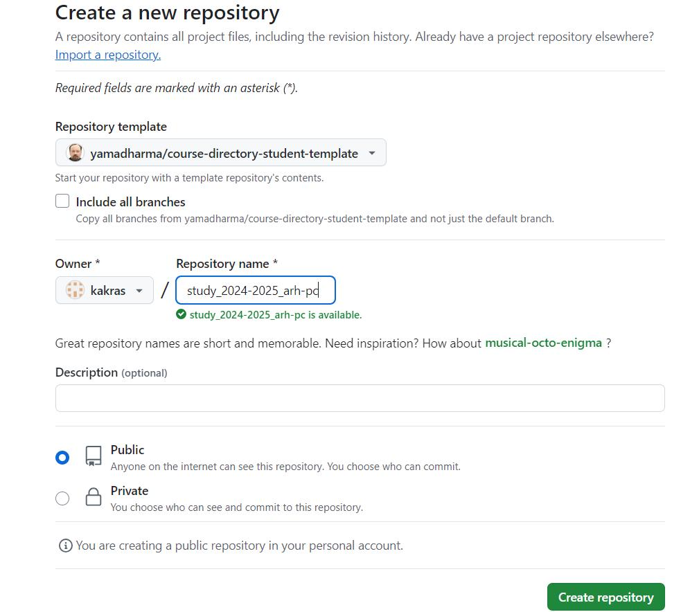

---
## Front matter
title: "Jтчёт по лабораторной работе №2"
subtitle: "Дисциплина: архитектура компьютера"
author: "Краснова Камилла Геннадьевна"

## Generic otions
lang: ru-RU
toc-title: "Содержание"

## Bibliography
bibliography: bib/cite.bib
csl: pandoc/csl/gost-r-7-0-5-2008-numeric.csl

## Pdf output format
toc: true # Table of contents
toc-depth: 2
lof: true # List of figures
lot: true # List of tables
fontsize: 12pt
linestretch: 1.5
papersize: a4
documentclass: scrreprt
## I18n polyglossia
polyglossia-lang:
  name: russian
  options:
	- spelling=modern
	- babelshorthands=true
polyglossia-otherlangs:
  name: english
## I18n babel
babel-lang: russian
babel-otherlangs: english
## Fonts
mainfont: IBM Plex Serif
romanfont: IBM Plex Serif
sansfont: IBM Plex Sans
monofont: IBM Plex Mono
mathfont: STIX Two Math
mainfontoptions: Ligatures=Common,Ligatures=TeX,Scale=0.94
romanfontoptions: Ligatures=Common,Ligatures=TeX,Scale=0.94
sansfontoptions: Ligatures=Common,Ligatures=TeX,Scale=MatchLowercase,Scale=0.94
monofontoptions: Scale=MatchLowercase,Scale=0.94,FakeStretch=0.9
mathfontoptions:
## Biblatex
biblatex: true
biblio-style: "gost-numeric"
biblatexoptions:
  - parentracker=true
  - backend=biber
  - hyperref=auto
  - language=auto
  - autolang=other*
  - citestyle=gost-numeric
## Pandoc-crossref LaTeX customization
figureTitle: "Рис."
tableTitle: "Таблица"
listingTitle: "Листинг"
lofTitle: "Список иллюстраций"
lotTitle: "Список таблиц"
lolTitle: "Листинги"
## Misc options
indent: true
header-includes:
  - \usepackage{indentfirst}
  - \usepackage{float} # keep figures where there are in the text
  - \floatplacement{figure}{H} # keep figures where there are in the text
---

# Цель работы

Целью данной работы является изучить идеологию и применение средств контроля версий, а также приобрести практические навыки по работе с системой git.

# Задание

    1. Настройка GitHub.
    2. Базовая настройка Git.
    3. Создание SSH-ключа.
    4. Создание рабочего пространства и репозитория курса на основе шаблона.
    5. Создание репозитория курса на основе шаблона.
    6. Настройка каталога курса.
    7. Выполнение заданий для самостоятельной работы.

# Теоретическое введение

Системы контроля версий (Version Control System, VCS) применяются при работе нескольких человек над одним проектом. Обычно основное дерево проекта хранится в локальном или удалённом репозитории, к которому настроен доступ для участников проекта. При внесении изменений в содержание проекта система контроля версий позволяет их фиксировать, совмещать изменения, произведённые разными участниками проекта, производить откат к любой более ранней версии проекта, если это требуется. В классических системах контроля версий используется централизованная модель, предполагающая наличие единого репозитория для хранения файлов. Выполнение большинства функций по управлению версиями осуществляется специальным сервером. Участник проекта (пользователь) перед началом работы посредством определённых команд получает нужную ему версию файлов. После внесения изменений пользователь размещает новую версию в хранилище. При этом предыдущие версии не удаляются из центрального хранилища и к ним можно вернуться в любой момент. Сервер может сохранять не полную версию изменённых файлов, а производить так называемую дельта-компрессию — сохранять только изменения между последовательными версиями, что позволяет уменьшить объём хранимых данных. Системы контроля версий поддерживают возможность отслеживания и разрешения конфликтов, которые могут возникнуть при работе нескольких человек над одним файлом. Можно объединить (слить) изменения, сделанные разными участниками (автоматически или вручную), вручную выбрать нужную версию, отменить изменения вовсе или заблокировать файлы для изменения. В зависимости от настроек блокировка не позволяет другим пользователям получить рабочую копию или препятствует изменению рабочей копии файла средствами файловой системы ОС, обеспечивая таким образом, привилегированный доступ только одному пользователю, работающему с файлом. Системы контроля версий также могут обеспечивать дополнительные, более гибкие функциональные возможности. Например, они могут поддерживать работу с несколькими версиями одного файла, сохраняя общую историю изменений до точки ветвления версий и собственные истории изменений каждой ветви. Кроме того, обычно доступна информация о том, кто из участников, когда и какие изменения вносил. Обычно такого рода информация хранится в журнале изменений, доступ к которому можно ограничить. В отличие от классических, в распределённых системах контроля версий центральный репозиторий не является обязательным. 
Среди классических VCS наиболее известны CVS, Subversion, а среди распределённых — Git, Bazaar, Mercurial. Принципы их работы схожи, отличаются они в основном синтаксисом используемых в работе команд. Система контроля версий Git представляет собой набор программ командной строки. Доступ к ним можно получить из терминала посредством ввода команды git с различными опциями.
Работа пользователя со своей веткой начинается с проверки и получения изменений из центрального репозитория (при этом в локальное дерево до начала этой процедуры не должно было вноситься изменений). Затем можно вносить изменения в локальном дереве и/или ветке. После завершения внесения какого-то изменения в файлы и/или каталоги проекта необходимо разместить их в центральном репозитории.

# Выполнение лабораторной работы

4.1 Настройка GitHub
Создаю учетную запись на сайте GitHub.  Аккаунт создан (рис. [-@fig:001]).
{#fig:001 width=70%}

4.2 Базовая настройка Git
Делаю предварительную конфигурацию git. Ввожу команду git config –global user.name <name> и git config –global user.email <work@mail>, указывая свое имя и свою почту (рис. [-@fig:002]).
{#fig:002 width=70%}

Настраиваю utf-8 в выводе сообщений git, задаю имя начальной ветки «master», задаю параметры autorclf и saferclf (рис. [-@fig:003]).
{#fig:003 width=70%}

4.3 Создание SSH-ключа
Для последующей идентификации пользователя на сервере репозиториев необходимо сгенерировать пару ключей (приватный и открытый). Для этого ввожу команду ssh-keygen -C “Имя Фамилия, work@email”,  указывая свое имя и почту (рис. [-@fig:004]).
{#fig:004 width=70%}

Копирую открытый ключ (рис. [-@fig:005]).
{#fig:005 width=70%}

Открываю свой профиль и выбираю страницу «SSH and GPG keys». Нажимаю кнопку «New SSH key» (рис. [-@fig:006]).
{#fig:006 width=70%}

Вставляю скопированный ключ в поле «Key». В поле Title указываю имя для ключа. Нажимаю «Add SSH-key», чтобы  добавить ключ (рис. [-@fig:007]).
{#fig:007 width=70%}

4.4 Создание рабочего пространства и репозитория курса на основе шаблона
Создаю каталог для предмета «Архитектура компьютера» с помощью mkdir и ключа -p. Проверяю с помощью ls правильность выполнения команды (рис. [-@fig:008]).
{#fig:008 width=70%}

4.5 Создание репозитория курса на основе шаблона
Перехожу на страницу репозитория с шаблоном курса по адресу https://github.com/yamadharma/course-directory-student-template. Далее выбираю «Use this template», чтобы использовать этот шаблон для своего репозитория (рис. [-@fig:009]).
{#fig:009 width=70%}

В открывшемся окне задаю имя репозитория: study_2024–2025_arh-pc и создаю репозиторий, нажимаю на кнопку «Create repository from template» (рис. [-@fig:010]).
{#fig:010 width=70%}

Созданный репозиторий (рис. [-@fig:011]).
{#fig:011 width=70%}

Перехожу в каталог курса и клонирую созданный репозиторий (рис. [-@fig:012]).
{#fig:012 width=70%}

Копирую ссылку для клонирования на странице созданного репозитория, сначала перейдя в окно «Сode», далее выбрав в окне вкладку «SSH» (рис. [-@fig:003]).
{#fig:013 width=70%}

4.6 Настройка каталога курса
Перехожу в каталог arch-pc с помощью cd (рис. [-@fig:014]).
{#fig:014 width=70%}

Удаляю лишние файлы (рис. [-@fig:015]).
{#fig:015 width=70%}

Создаю необходимые каталоги. Затем добавляю созданные каталоги с помощью git add и сохраняю изменения на сервере (рис. [-@fig:016]).
{#fig:016 width=70%}

Отправляю все на сервер (рис. [-@fig:017]).
{#fig:017 width=70%}

Проверяю правильность выполнения работы сначала на странице GitHub (рис. [-@fig:018]), а затем в локальном репозитории (рис. [-@fig:019]).
{#fig:018 width=70%}
{#fig:019 width=70%}

4.7 Выполнение заданий для самостоятельной работы
1. Создаю в директории labs/lab02/report файл для отчета по второй лабораторной работе с помощью touch. Проверяю правильность выполнения команды (рис. [-@fig:020]).
{#fig:020 width=70%}

2. Перехожу из подкаталога lab02/report в подкаталог lab01/report с помощью cd (рис. [-@fig:021]).
{#fig:021 width=70%}

Проверяю местонахождение файла с отчетом по первой лабораторной работе (рис. [-@fig:022]).
{#fig:022 width=70%}

Копирую первую лабораторную работу с помощью cp и проверяю правильность выполнения команды с помощью ls (рис. [-@fig:023]).
{#fig:023 width=70%}

3.  Добавляю с помощью git add файл Л01_Краснова_отчет, сохраняю изменения на сервере и отправляю сохраненные изменения в репозиторий (рис. [-@fig:024]).
{#fig:024 width=70%}

Проверяю на GitHub правильность выполнения заданий. Файл с отчетом находится в соответствующем каталоге репозитория (рис. [-@fig:025]).
{#fig:025 width=70%}

То же самое проделываю для файла Л02_Краснова_отчет.pdf.

# Выводы

При выполнении данной лабораторной работы я изучила идеологию и применение средств контроля версий, а также приобрела практические навыки по работе с системой git.

# Список литературы{.unnumbered}

[Git – gitattributes Документация](https://git-scm.com/docs/gitattributes)
