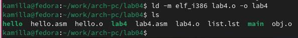

---
## Front matter
title: "Отчет по лабораторной работе №4"
subtitle: "Дисциплина: Архитектура компьютера"
author: "Краснова Камилла Геннадьевна"

## Generic otions
lang: ru-RU
toc-title: "Содержание"

## Bibliography
bibliography: bib/cite.bib
csl: pandoc/csl/gost-r-7-0-5-2008-numeric.csl

## Pdf output format
toc: true # Table of contents
toc-depth: 2
lof: true # List of figures
lot: true # List of tables
fontsize: 12pt
linestretch: 1.5
papersize: a4
documentclass: scrreprt
## I18n polyglossia
polyglossia-lang:
  name: russian
  options:
	- spelling=modern
	- babelshorthands=true
polyglossia-otherlangs:
  name: english
## I18n babel
babel-lang: russian
babel-otherlangs: english
## Fonts
mainfont: IBM Plex Serif
romanfont: IBM Plex Serif
sansfont: IBM Plex Sans
monofont: IBM Plex Mono
mathfont: STIX Two Math
mainfontoptions: Ligatures=Common,Ligatures=TeX,Scale=0.94
romanfontoptions: Ligatures=Common,Ligatures=TeX,Scale=0.94
sansfontoptions: Ligatures=Common,Ligatures=TeX,Scale=MatchLowercase,Scale=0.94
monofontoptions: Scale=MatchLowercase,Scale=0.94,FakeStretch=0.9
mathfontoptions:
## Biblatex
biblatex: true
biblio-style: "gost-numeric"
biblatexoptions:
  - parentracker=true
  - backend=biber
  - hyperref=auto
  - language=auto
  - autolang=other*
  - citestyle=gost-numeric
## Pandoc-crossref LaTeX customization
figureTitle: "Рис."
tableTitle: "Таблица"
listingTitle: "Листинг"
lofTitle: "Список иллюстраций"
lotTitle: "Список таблиц"
lolTitle: "Листинги"
## Misc options
indent: true
header-includes:
  - \usepackage{indentfirst}
  - \usepackage{float} # keep figures where there are in the text
  - \floatplacement{figure}{H} # keep figures where there are in the text
---

# Цель работы

Цель данной лабораторной работы – освоить процедуры компиляции и сборки программ, написанных на ассемблере NASM.

# Задание

    1. Создание программы Hello world!
    2. Работа с транслятором NASM
    3. Работа с расширенным синтаксисом командной строки NASM
    4. Работа с компоновщиком LD
    5. Запуск исполняемого файла
    6. Выполнение заданий для самостоятельной работы

# Теоретическое введение

Основными функциональными элементами любой электронно-вычислительной машины (ЭВМ) являются центральный процессор, память и периферийные устройства. Взаимодействие этих устройств осуществляется через общую шину, к которой они подключены. Физически шина представляет собой большое количество проводников, соединяющих устройства друг с другом. В современных компьютерах проводники выполнены в виде электропроводящих дорожек на материнской (системной) плате. Основной задачей процессора является обработка информации, а также организация координации всех узлов компьютера. В состав центрального процессора (ЦП) входят следующие устройства: 
• арифметико-логическое устройство (АЛУ) — выполняет логические и арифметические действия, необходимые для обработки информации, хранящейся в памяти; 
• устройство управления (УУ) — обеспечивает управление и контроль всех устройств компьютера;
 • регистры — сверхбыстрая оперативная память небольшого объёма, входящая в состав процессора, для временного хранения промежуточных результатов выполнения инструкций; регистры процессора делятся на два типа: регистры общего назначения и специальные регистры.
Для того, чтобы писать программы на ассемблере, необходимо знать, какие регистры процессора существуют и как их можно использовать. Большинство команд в программах написанных на ассемблере используют регистры в качестве операндов. Практически все команды представляют собой преобразование данных хранящихся в регистрах процессора, это например пересылка данных между регистрами или между регистрами и памятью, преобразование (арифметические или логические операции) данных хранящихся в регистрах.
Доступ к регистрам осуществляется не по адресам, как к основной памяти, а по именам. Каждый регистр процессора архитектуры x86 имеет свое название, состоящее из 2 или 3 букв латинского алфавита. В качестве примера приведем названия основных регистров общего назначения (именно эти регистры чаще всего используются при написании программ): 
• RAX, RCX, RDX, RBX, RSI, RDI — 64-битные 
• EAX, ECX, EDX, EBX, ESI, EDI — 32-битные 
• AX, CX, DX, BX, SI, DI — 16-битные 
• AH, AL, CH, CL, DH, DL, BH, BL — 8-битные (половинки 16-битных регистров). Например, AH (high AX) — старшие 8 бит регистра AX, AL (low AX) — младшие 8 бит регистра AX.
Другим важным узлом ЭВМ является оперативное запоминающее устройство (ОЗУ). ОЗУ — это быстродействующее энергозависимое запоминающее устройство, которое напрямую взаимодействует с узлами процессора, предназначенное для хранения программ и данных, с которыми процессор непосредственно работает в текущий момент. ОЗУ состоит из одинаковых пронумерованных ячеек памяти. Номер ячейки памяти — это адрес хранящихся в ней данных. В состав ЭВМ также входят периферийные устройства, которые можно разделить на: 
• устройства внешней памяти, которые предназначены для долговременного хранения больших объёмов данных (жёсткие диски, твердотельные накопители, магнитные ленты);
• устройства ввода-вывода, которые обеспечивают взаимодействие ЦП с внешней средой. В основе вычислительного процесса ЭВМ лежит принцип программного управления. Это означает, что компьютер решает поставленную задачу как последовательность действий, записанных в виде программы. Программа состоит из машинных команд, которые указывают, какие операции и над какими данными (или операндами), в какой последовательности необходимо выполнить. Коды команд представляют собой многоразрядные двоичные комбинации из 0 и 1. В коде машинной команды можно выделить две части: операционную и адресную. В операционной части хранится код команды, которую необходимо выполнить. В адресной части хранятся данные или адреса данных, которые участвуют в выполнении данной операции. При выполнении каждой команды процессор выполняет определённую последовательность стандартных действий, которая называется командным циклом процессора. В самом общем виде он заключается в следующем:
 1. формирование адреса в памяти очередной команды; 
2. считывание кода команды из памяти и её дешифрация; 
3. выполнение команды; 
4. переход к следующей команде. 
Данный алгоритм позволяет выполнить хранящуюся в ОЗУ программу. Кроме того, в зависимости от команды при её выполнении могут проходить не все этапы.

# Выполнение лабораторной работы

4.1 Создание программы Hello world!
Создаю каталог для работы с программами, перехожу в него с помощью утилиты cd (рис. [-@fig:001]).

{#fig:001 width=70%}

Создаю в текущем каталоге текстовый файл hello.asm, используя touch, и открываю его с помощью текстового редактора gedit (рис. [-@fig:002]).

{#fig:002 width=70%}

Заполняю файл, вставляя в него программу для вывода “Hello world!” (рис. [-@fig:003]).

{#fig:003 width=70%}

4.2 Работа с транслятором NASM
Компилирую текст программы “Hello world!”, используя команду nasm -f elf hello.asm. Проверяю, что создан объектный файл hello.o (рис. [-@fig:004]).

{#fig:004 width=70%}

4.3 Работа с расширенным синтаксисом командной строки NASM
Компилирую файл hello.asm в obj.o. Далее проверяю, что файлы были созданы (рис. [-@fig:005]).

{#fig:005 width=70%}

4.4 Работа с компоновщиком LD
Передаю объектный файл hello.o на обработку компоновщику LD, чтобы получить исполняемый файл hello. Далее проверяю правильность выполнения команды (рис. [-@fig:006]).

{#fig:006 width=70%}

Выполняю следующую команду (рис. [-@fig:007]). Исполняемый файл будет иметь имя main, т.к после ключа -о было задано значение main. Объектный файл, из которого собран этот исполняемый файл, имеет имя obj.o.

{#fig:007 width=70%}

4.5 Запуск исполняемого файла
Запускаю на выполнение созданный исполняемый файл hello (рис. [-@fig:008]).

{#fig:008 width=70%}

4.6 Выполнение заданий для самостоятельной работы
С помощью команды cp создаю в текущем каталоге копию файла hello.asm с именем lab4.asm (рис. [-@fig:009]).

{#fig:009 width=70%}

С помощью текстового редактора gedit открываю файл lab4.asm и вношу изменения в программу так, чтобы она выводила мои имя и фамилию (рис. [-@fig:0010]).

{#fig:0010 width=70%}

Компилирую текст программы в объектный файл. Проверяю, что файл lab4.o создан (рис. [-@fig:0011]).

{#fig:0011 width=70%}

Передаю объектный файл lab4.o на обработку компоновщику LD, чтобы получить исполняемый файл lab4 (рис. [-@fig:0012]).

{#fig:0012 width=70%}

Запускаю исполняемый файл lab4, вижу, что на экран действительно выводятся мои имя и фамилия (рис. [-@fig:0013]).

{#fig:0013 width=70%}

Копирую файлы hello.asm и lab4.asm в свой локальный репозиторий, проверяю с помощью ls, что файлы скопировались (рис. [-@fig:0014]).

{#fig:0014 width=70%}

С помощью команд git add . (рис. [-@fig:0015]) и git commit (рис. [-@fig:0016] добавляю файлы на GitHub.

{#fig:0015 width=70%}
{#fig:0016 width=70%}

Отправляю файлы на сервер с помощью команды git push (рис. [-@fig:0017]).

{#fig:0017 width=70%}

# Выводы

При выполнении данной лабораторной работы я освоила процедуры компиляции и сборки программ, написанных на ассемблере NASM.

# Список литературы{.unnumbered}

1. [Архитектура ЭВМ](https://esystem.rudn.ru/pluginfile.php/2089084/mod_resource/content/0/%D0%9B%D0%B0%D0%B1%D0%BE%D1%80%D0%B0%D1%82%D0%BE%D1%80%D0%BD%D0%B0%D1%8F%20%D1%80%D0%B0%D0%B1%D0%BE%D1%82%D0%B0%20%E2%84%964.%20%D0%A1%D0%BE%D0%B7%D0%B4%D0%B0%D0%BD%D0%B8%D0%B5%20%D0%B8%20%D0%BF%D1%80%D0%BE%D1%86%D0%B5%D1%81%D1%81%20%D0%BE%D0%B1%D1%80%D0%B0%D0%B1%D0%BE%D1%82%D0%BA%D0%B8%20%D0%BF%D1%80%D0%BE%D0%B3%D1%80%D0%B0%D0%BC%D0%BC%20%D0%BD%D0%B0%20%D1%8F%D0%B7%D1%8B%D0%BA%D0%B5%20%D0%B0%D1%81%D1%81%D0%B5%D0%BC%D0%B1%D0%BB%D0%B5%D1%80%D0%B0%20NASM.pdf)
