---
## Front matter
title: "Отчет по лабораторной работе №8"
subtitle: "Дисциплина: Архитектура компьютера"
author: "Краснова Камилла Геннадьевна"

## Generic otions
lang: ru-RU
toc-title: "Содержание"

## Bibliography
bibliography: bib/cite.bib
csl: pandoc/csl/gost-r-7-0-5-2008-numeric.csl

## Pdf output format
toc: true # Table of contents
toc-depth: 2
lof: true # List of figures
lot: true # List of tables
fontsize: 12pt
linestretch: 1.5
papersize: a4
documentclass: scrreprt
## I18n polyglossia
polyglossia-lang:
  name: russian
  options:
	- spelling=modern
	- babelshorthands=true
polyglossia-otherlangs:
  name: english
## I18n babel
babel-lang: russian
babel-otherlangs: english
## Fonts
mainfont: IBM Plex Serif
romanfont: IBM Plex Serif
sansfont: IBM Plex Sans
monofont: IBM Plex Mono
mathfont: STIX Two Math
mainfontoptions: Ligatures=Common,Ligatures=TeX,Scale=0.94
romanfontoptions: Ligatures=Common,Ligatures=TeX,Scale=0.94
sansfontoptions: Ligatures=Common,Ligatures=TeX,Scale=MatchLowercase,Scale=0.94
monofontoptions: Scale=MatchLowercase,Scale=0.94,FakeStretch=0.9
mathfontoptions:
## Biblatex
biblatex: true
biblio-style: "gost-numeric"
biblatexoptions:
  - parentracker=true
  - backend=biber
  - hyperref=auto
  - language=auto
  - autolang=other*
  - citestyle=gost-numeric
## Pandoc-crossref LaTeX customization
figureTitle: "Рис."
tableTitle: "Таблица"
listingTitle: "Листинг"
lofTitle: "Список иллюстраций"
lotTitle: "Список таблиц"
lolTitle: "Листинги"
## Misc options
indent: true
header-includes:
  - \usepackage{indentfirst}
  - \usepackage{float} # keep figures where there are in the text
  - \floatplacement{figure}{H} # keep figures where there are in the text
---


# Цель работы

Цель данной лабораторной работы - приобретение навыков написания программ с использованием циклов обработкой аргументов командной строки.

# Задание

1. Реализация циклов в NASM
2. Обработка аргументов командной строки
3. Выполнение заданий для самостоятельной работы

# Теоретическое введение

Стек — это структура данных, организованная по принципу LIFO («Last In — First Out» или «последним пришёл — первым ушёл»). Стек является частью архитектуры процессора и реализован на аппаратном уровне. Для работы со стеком в процессоре есть специальные регистры (ss, bp, sp) и команды. 
Основной функцией стека является функция сохранения адресов возврата и передачи аргументов при вызове процедур. Кроме того, в нём выделяется память для локальных переменных и могут временно храниться значения регистров.
Стек имеет вершину, адрес последнего добавленного элемента, который хранится в ре- гистре esp (указатель стека). Противоположный конец стека называется дном. Значение, помещённое в стек последним, извлекается первым. При помещении значения в стек указа- тель стека уменьшается, а при извлечении — увеличивается.
Для стека существует две основные операции:
• добавление элемента в вершину стека (push);
• извлечение элемента из вершины стека (pop).
Команда push размещает значение в стеке, т.е. помещает значение в ячейку памяти, на которую указывает регистр esp, после этого значение регистра esp увеличивается на 4. Данная команда имеет один операнд — значение, которое необходимо поместить в стек.
Команда pop извлекает значение из стека, т.е. извлекает значение из ячейки памяти, на которую указывает регистр esp, после этого уменьшает значение регистра esp на 4. У этой команды также один операнд, который может быть регистром или переменной в памяти.
Нужно помнить, что извлечённый из стека элемент не стирается из памяти и остаётся как “мусор”, который будет перезаписан при записи нового значения в стек.


# Выполнение лабораторной работы

## Реализация циклов в NASM

С помощью утилиты mkdir создаю директорию, в которой буду создавать файлы с программами для лабораторной работы №8 Перехожу в созданный каталог с помощью утилиты cd и с помощью утилиты touch создаю файл lab8-1.asm.(рис. [-@fig:001]).

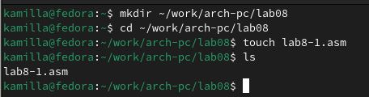{ #fig:001 width=70% }

Открываю созданный файл lab8-1.asm, вставляю в него программу, которая выводит значение регистра ecx.  (рис. [-@fig:002]).

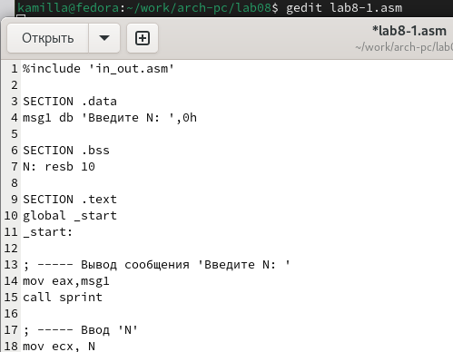{ #fig:002 width=70% }

Создаю исполняемый файл программы и запускаю его (рис. [-@fig:003]).

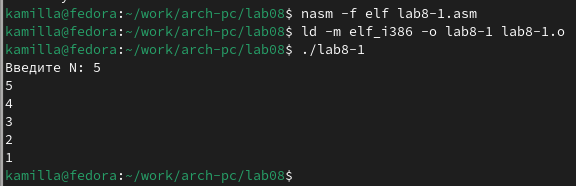{ #fig:003 width=70% }

Изменяю текст программы (рис. [-@fig:004]). 

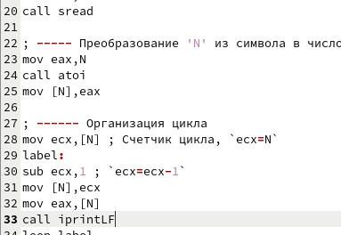{ #fig:006=4 width=70% }

Создаю новый исполняемый файл программы и запускаю его (рис. [-@fig:005]). Количество итераций уменьшается вдвое, так как регистр ecx на каждой итерации уменьшается на 2 значения.

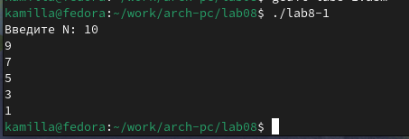{ #fig:005 width=70% }

Изменяю текст программы, добавив команды push и pop (рис. [-@fig:006]).

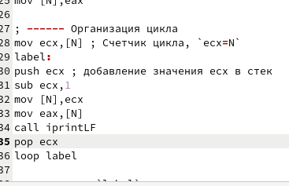{ #fig:006 width=70% }

Создаю новый исполняемый файл программы и запускаю его (рис. [-@fig:007]). Количество проходов цикла по значению N совпадает, но происходит смещение на -1.

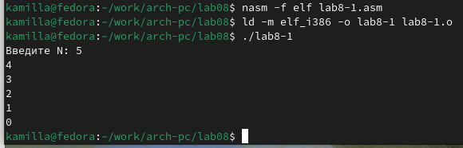{ #fig:007 width=70% }

## Обработка аргументов командной строки

Создаю файл lab8-2.asm в каталоге ~/work/arch-pc/lab08 и ввожу в него текст программы (рис. [-@fig:008]). 

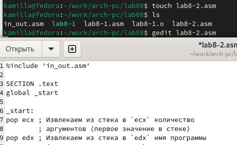{ #fig:008 width=70% }

Создаю и запускаю новый исполняемый файл (рис. [-@fig:009]). Было обработано столько же аргументов, сколько было введено.

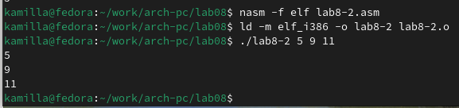{ #fig:009 width=70% }

Создаю файл lab8-3.asm в каталоге ~/work/arch-pc/lab08 и ввожу в него текст программы вычисления суммы аргументов командной строки (рис. [-@fig:010]). 

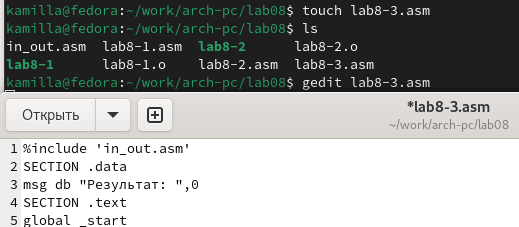{ #fig:010 width=70% }


Создаю и запускаю, указав аргументы, исполняемый файл (рис. [-@fig:011]).

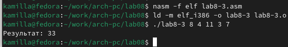{ #fig:011 width=70% }

Редактирую текст программы для вычисления произведение аргументов строки (рис. [-@fig:012]). 
 
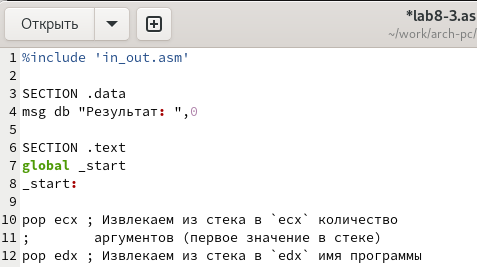{ #fig:012 width=70% }

Создаю и запускаю исполняемый файл (рис. [-@fig:013]). Программы работает верно.

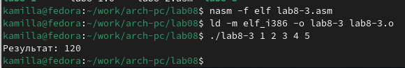{ #fig:013 width=70% }

## Выполнение заданий для самостоятельной работы

1. Создаю файл lab8-4.asm с помощью утилиты touch (рис. [-@fig:014]).

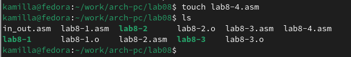{ #fig:014 width=70% }

Ввожу в созданный файл программу для нахождения суммы значений функции 𝑓(𝑥) для 𝑥 = 𝑥1, 𝑥2, ..., 𝑥𝑛 (рис. [-@fig:015]). Мой вариант - 17.

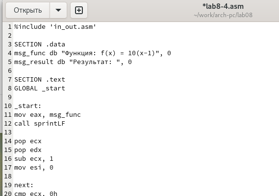{ #fig:015 width=70% }

Создаю и запускаю новый исполняемый файл (рис. [-@fig:016]). 

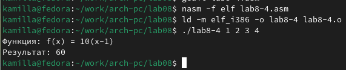{ #fig:016 width=70% }


**Листинг. Программа для нахождения суммы значений функции 𝑓(𝑥) для 𝑥 = 𝑥1, 𝑥2, ..., 𝑥𝑛.**

```%include 'in_out.asm'

SECTION .data
msg_func db "Функция: f(x) = 10(x-1)", 0
msg_result db "Результат: ", 0

SECTION .text
GLOBAL _start

_start:
mov eax, msg_func
call sprintLF

pop ecx
pop edx
sub ecx, 1
mov esi, 0

next:
cmp ecx, 0h
jz _end
pop eax
call atoi

sub eax, 1
mov ebx, 10
mul ebx

add esi, eax

loop next

_end: 
mov eax, msg_result
call sprint
mov eax, esi
call iprintLF
call quit
```

# Выводы

При выполнении данной лабораторной работы я приобрела навыки написания программ с использованием циклов и обработкой аргументов командной строки.

# Список литературы

1. [Лабораторная работа №8](https://esystem.rudn.ru/pluginfile.php/2089095/mod_resource/content/0/%D0%9B%D0%B0%D0%B1%D0%BE%D1%80%D0%B0%D1%82%D0%BE%D1%80%D0%BD%D0%B0%D1%8F%20%D1%80%D0%B0%D0%B1%D0%BE%D1%82%D0%B0%20%E2%84%968.%20%D0%9F%D1%80%D0%BE%D0%B3%D1%80%D0%B0%D0%BC%D0%BC%D0%B8%D1%80%D0%BE%D0%B2%D0%B0%D0%BD%D0%B8%D0%B5%20%D1%86%D0%B8%D0%BA%D0%BB%D0%B0.%20%D0%9E%D0%B1%D1%80%D0%B0%D0%B1%D0%BE%D1%82%D0%BA%D0%B0%20%D0%B0%D1%80%D0%B3%D1%83%D0%BC%D0%B5%D0%BD%D1%82%D0%BE%D0%B2%20%D0%BA%D0%BE%D0%BC%D0%B0%D0%BD%D0%B4%D0%BD%D0%BE%D0%B9%20%D1%81%D1%82%D1%80%D0%BE%D0%BA%D0%B8..pdf)
