---
## Front matter
title: "Отчет по лабораторной работе №9"
subtitle: "Дисциплина: Архитектура компьютера"
author: "Краснова Камилла Геннадьевна"

## Generic otions
lang: ru-RU
toc-title: "Содержание"

## Bibliography
bibliography: bib/cite.bib
csl: pandoc/csl/gost-r-7-0-5-2008-numeric.csl

## Pdf output format
toc: true # Table of contents
toc-depth: 2
lof: true # List of figures
lot: true # List of tables
fontsize: 12pt
linestretch: 1.5
papersize: a4
documentclass: scrreprt
## I18n polyglossia
polyglossia-lang:
  name: russian
  options:
	- spelling=modern
	- babelshorthands=true
polyglossia-otherlangs:
  name: english
## I18n babel
babel-lang: russian
babel-otherlangs: english
## Fonts
mainfont: IBM Plex Serif
romanfont: IBM Plex Serif
sansfont: IBM Plex Sans
monofont: IBM Plex Mono
mathfont: STIX Two Math
mainfontoptions: Ligatures=Common,Ligatures=TeX,Scale=0.94
romanfontoptions: Ligatures=Common,Ligatures=TeX,Scale=0.94
sansfontoptions: Ligatures=Common,Ligatures=TeX,Scale=MatchLowercase,Scale=0.94
monofontoptions: Scale=MatchLowercase,Scale=0.94,FakeStretch=0.9
mathfontoptions:
## Biblatex
biblatex: true
biblio-style: "gost-numeric"
biblatexoptions:
  - parentracker=true
  - backend=biber
  - hyperref=auto
  - language=auto
  - autolang=other*
  - citestyle=gost-numeric
## Pandoc-crossref LaTeX customization
figureTitle: "Рис."
tableTitle: "Таблица"
listingTitle: "Листинг"
lofTitle: "Список иллюстраций"
lotTitle: "Список таблиц"
lolTitle: "Листинги"
## Misc options
indent: true
header-includes:
  - \usepackage{indentfirst}
  - \usepackage{float} # keep figures where there are in the text
  - \floatplacement{figure}{H} # keep figures where there are in the text
---


# Цель работы

Цель данной лабораторной работы - приобретение навыков написания программ с использованием подпрограмм. Знакомство с методами отладки при помощи GDB и его основными возможностями.

# Задание

1. Реализация подпрограмм в NASM
2. Отладка программ с помощью GDB
3. Самостоятельное выполнение заданий по материалам лабораторной работы

# Теоретическое введение

Отладка — это процесс поиска и исправления ошибок в программе. В общем случае его можно разделить на четыре этапа:

• обнаружение ошибки;
• поиск её местонахождения;
• определение причины ошибки;
• исправление ошибки.

Можно выделить следующие типы ошибок:

• синтаксические ошибки — обнаруживаются во время трансляции исходного кода и вызваны нарушением ожидаемой формы или структуры языка;
• семантические ошибки — являются логическими и приводят к тому, что программа запускается, отрабатывает, но не даёт желаемого результата;
• ошибки в процессе выполнения — не обнаруживаются при трансляции и вызывают пре- рывание выполнения программы (например, это ошибки, связанные с переполнением или делением на ноль).

Второй этап — поиск местонахождения ошибки. Некоторые ошибки обнаружить доволь- но трудно. Лучший способ найти место в программе, где находится ошибка, это разбить программу на части и произвести их отладку отдельно друг от друга.

Третий этап — выяснение причины ошибки. После определения местонахождения ошибки обычно проще определить причину неправильной работы программы. 
Последний этап — исправление ошибки. После этого при повторном запуске программы, может обнаружиться следующая ошибка, и процесс отладки начнётся заново.

Наиболее часто применяют следующие методы отладки:
• создание точек контроля значений на входе и выходе участка программы (например, вывод промежуточных значений на экран — так называемые диагностические сообщения);

• использование специальных программ-отладчиков. Отладчики позволяют управлять ходом выполнения программы, контролировать и изменять данные. Это помогает быстрее найти место ошибки в программе и ускорить её исправление. Наиболее популярные способы работы с отладчиком — это использование точек останова и выполнение программы по шагам.

Пошаговое выполнение — это выполнение программы с остановкой после каждой строчки, чтобы программист мог проверить значения переменных и выполнить другие действия.
Точки останова — это специально отмеченные места в программе, в которых программа- отладчик приостанавливает выполнение программы и ждёт команд. Наиболее популярные виды точек останова:
• Breakpoint — точка останова (остановка происходит, когда выполнение доходит до определённой строки, адреса или процедуры, отмеченной программистом);

• Watchpoint — точка просмотра (выполнение программы приостанавливается, если программа обратилась к определённой переменной: либо считала её значение, либо изменила его).

Точки останова устанавливаются в отладчике на время сеанса работы с кодом програм- мы, т.е. они сохраняются до выхода из программы-отладчика или до смены отлаживаемой программы.

# Выполнение лабораторной работы

## Реализация подпрограмм в NASM

С помощью утилиты mkdir создаю директорию, в которой буду создавать файлы с программами для лабораторной работы №9. Перехожу в созданный каталог с помощью утилиты cd и с помощью утилиты touch создаю файл lab09-1.asm.(рис. [-@fig:001]).

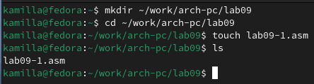{ #fig:001 width=70% }

Открываю созданный файл lab09-1.asm, вставляю в него программу (рис. [-@fig:002]).

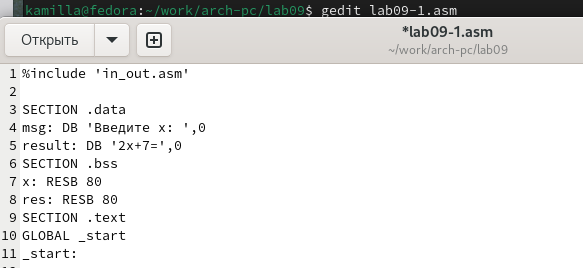{ #fig:002 width=70% }

Создаю исполняемый файл программы и запускаю его (рис. [-@fig:003]).

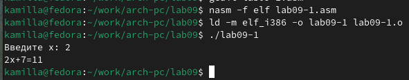{ #fig:003 width=70% }

Изменяю текст программы , добавляя подпрограмму _subcalcul в подпрограмму _calcul(рис. [-@fig:004]). 

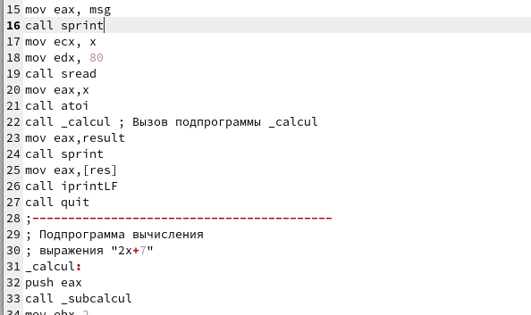{ #fig:004 width=70% }

Создаю новый исполняемый файл программы и запускаю его (рис. [-@fig:005]). 

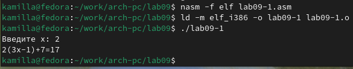{ #fig:005 width=70% }

## Отладка программам с помощью GDB

Создаю файл lab09-2.asm (рис. [-@fig:006]).

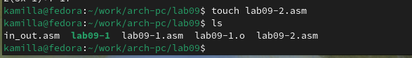{ #fig:006 width=70% }

Открываю созданный файл lab09-2.asm, вставляю в него программу (рис. [-@fig:007]).

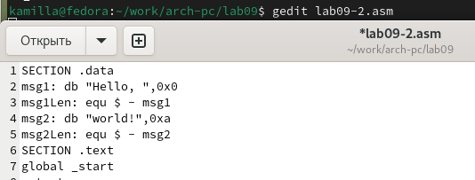{ #fig:007 width=70% }

Получаю исполняемый файл. Трансляцию программ провожу с ключом '-g' (рис. [-@fig:008]). 

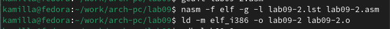{ #fig:008 width=70% }

Загружаю исполняемый файл в отладчик gdb (рис. [-@fig:009]).

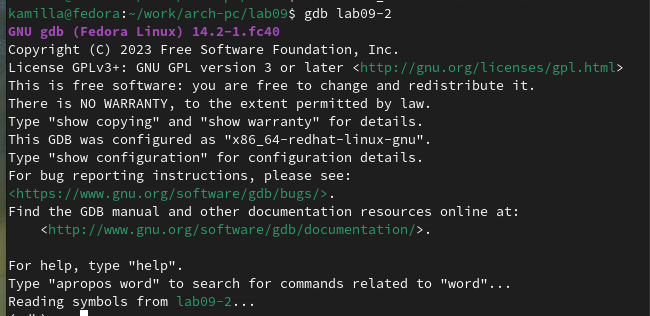{ #fig:009 width=70% }

Проверяю работу программы, запустив ее в оболочке GDB (рис. [-@fig:010]).

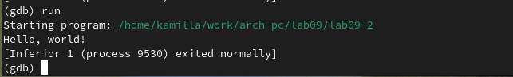{ #fig:010 width=70% }

Устанавливаю брекпоинт на метку _start и запускаю программу (рис. [-@fig:011]).

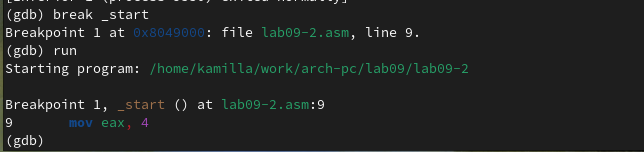{ #fig:011 width=70% }

Далее смотрю дисассимилированный код программы (рис. [-@fig:012]). 
 
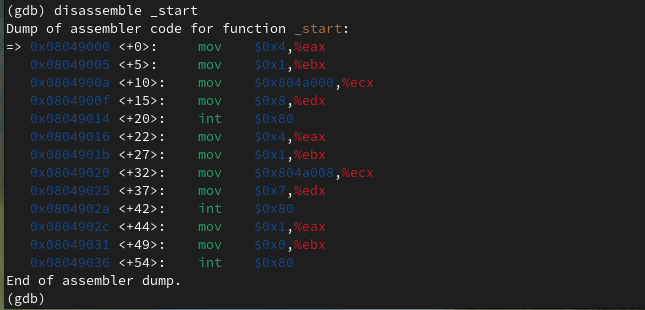{ #fig:012 width=70% }

Переключаюсь на отображение команд с Intel’овским синтаксисом, введя команду set disassembly-flavor intel (рис. [-@fig:013]). 

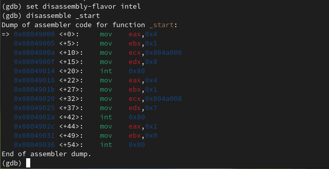{ #fig:013 width=70% }

Включаю режим псевдографики (рис. [-@fig:014]) и (рис. [-@fig:015]).

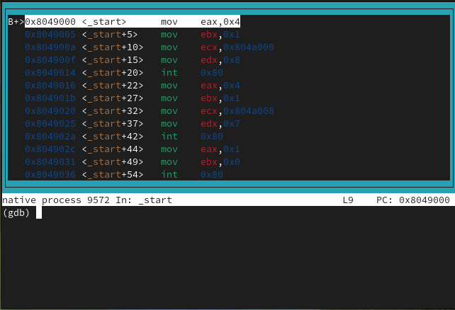{ #fig:014 width=70% } 

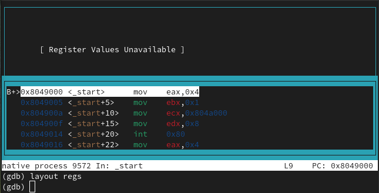{ #fig:015 width=70% }

Различия между синтаксисом ATT и Intel заключаются в порядке операндов (ATT - Операнд источника указан первым. Intel - Операнд назначения указан первым), их размере (ATT - pазмер операндов указывается явно с помощью суффиксов, непосредственные операнды предваряются символом $; Intel - Размер операндов неявно определяется контекстом, как ax, eax, непосредственные операнды пишутся напрямую), именах регистров(ATT - имена регистров предваряются символом %, Intel - имена регистров пишутся без префиксов).

## Добавление точек останова

Проверяю установку точки останова по имени метки (рис. [-@fig:016]). 

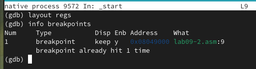{ #fig:016 width=70% }

Устанавливаю точку останова по адресу инструкции (рис. [-@fig:017]). 

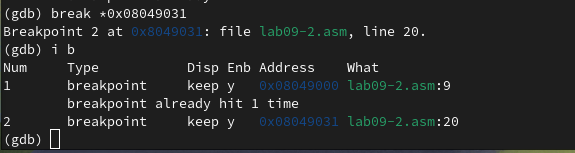{ #fig:017 width=70% }

## Работа с данными программы в GDB

Просматриваю содержимое регистров командой info registers (рис. [-@fig:018]).

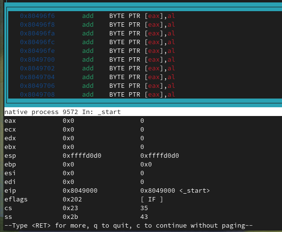{ #fig:018 width=70% }

Смотрю содержимое переменных по имени и по адресу (рис. [-@fig:019]). 

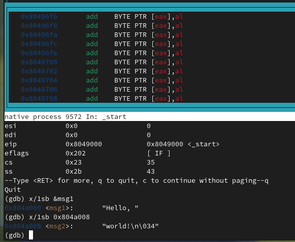{ #fig:019 width=70% }

Меняю содержимое переменных по имени и по адресу (рис. [-@fig:020]) и (рис. [-@fig:021]).

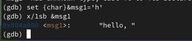{#fig:020 width=70%}
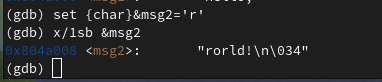{#fig:021 width=70%}

Вывожу в различных форматах значение регистра edx (рис. [-@fig:022]).

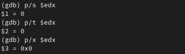{#fig:022 width=70%}

С помощью команды set меняю содержимое регистра ebx (рис. [-@fig:023]).

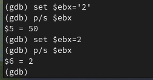{#fig:023 width=70%}

## Обработка аргументов командной строки в GDB

Копирую программу из предыдущей лабораторной работы в текущий каталог и и создаю исполняемый файл с файлом листинга и отладки (рис. [-@fig:024]).

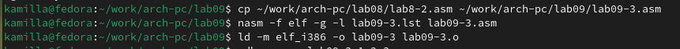{#fig:024 width=70%}

Запускаю программу с режиме отладки с указанием аргументов (рис. [-@fig:025]).

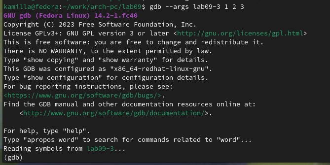{#fig:025 width=70%}

Указываю брейкпопнт и запускаю отладку. (рис. [-@fig:06]).

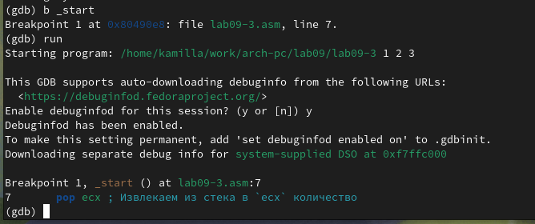{#fig:026 width=70%}

Проверяю работу стека, изменяя аргумент команды просмотра регистра esp на +4, число обусловлено разрядностью системы, а указатель void занимает как раз 4 байта.
Ошибка при аргументе +20 означает, что аргументы на вход программы закончились. (рис. [-@fig:027]).

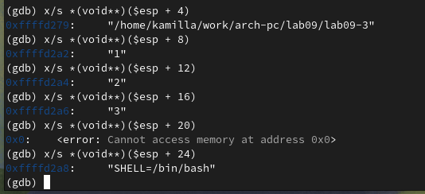{#fig:027 width=70%}

## Задание для самостоятельной работы 

1. Меняю программу самостоятельной части предыдущей лабораторной работы с использованием подпрограммы (рис. [-@fig:028]).

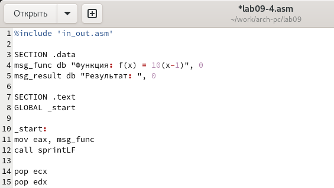{#fig:028 width=70%}

Код программы:

```NASM
%include 'in_out.asm'

SECTION .data
msg_func db "Функция: f(x) = 10x - 4", 0
msg_result db "Результат: ", 0

SECTION .text
GLOBAL _start

_start:
mov eax, msg_func
call sprintLF

pop ecx
pop edx
sub ecx, 1
mov esi, 0

next:
cmp ecx, 0h
jz _end
pop eax
call atoi

call _calculate_fx

add esi, eax
loop next

_end: 
mov eax, msg_result
call sprint
mov eax, esi
call iprintLF
call quit

_calculate_fx:
mov ebx, 10
mul ebx
sub eax, 4
```
2. Запускаю программу в режике отладичка и просматриваю изменение значений регистров через i r.
При выполнении инструкции mul ecx можно заметить, что результат умножения записывается в регистр eax, но также меняет и edx. 
Значение регистра ebx не обновляется напрямую, поэтому программа неверно подсчитывает функцию (рис. [-@fig:029]).

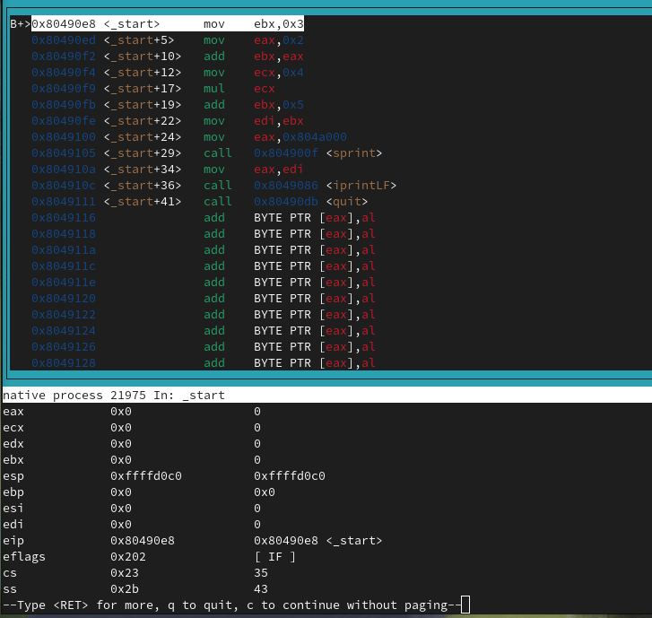{#fig:029 width=70%}

Исправляю найденную ошибку, теперь программа верно считает значение функции (рис. [-@fig:030]).

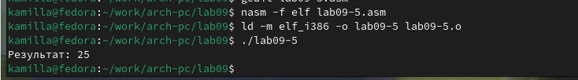{#fig:030 width=70%}

Код измененной программы: 

```NASM
%include 'in_out.asm'

SECTION .data
div: DB 'Результат: ', 0

SECTION .text
GLOBAL _start
_start:

mov ebx, 3
mov eax, 2
add ebx, eax
mov eax, ebx
mov ecx, 4
mul ecx
add eax, 5
mov edi, eax

mov eax, div
call sprint
mov eax, edi
call iprintLF

call quit
```


# Выводы

При выполнении данной лабораторной работы я приобрела навыки написания программ с использованием подпрограмм, а так же познакомилась с методами отладки при поомщи GDB и его основными возможностями.

# Список литературы

1. [Лабораторная работа №9](https://esystem.rudn.ru/pluginfile.php/2089096/mod_resource/content/0/%D0%9B%D0%B0%D0%B1%D0%BE%D1%80%D0%B0%D1%82%D0%BE%D1%80%D0%BD%D0%B0%D1%8F%20%D1%80%D0%B0%D0%B1%D0%BE%D1%82%D0%B0%20%E2%84%969.%20%D0%9F%D0%BE%D0%BD%D1%8F%D1%82%D0%B8%D0%B5%20%D0%BF%D0%BE%D0%B4%D0%BF%D1%80%D0%BE%D0%B3%D1%80%D0%B0%D0%BC%D0%BC%D1%8B.%20%D0%9E%D1%82%D0%BB%D0%B0%D0%B4%D1%87%D0%B8%D0%BA%20.pdf)
