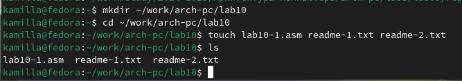
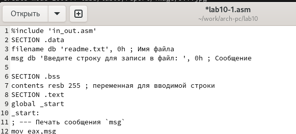
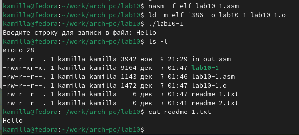
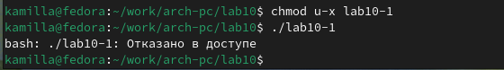
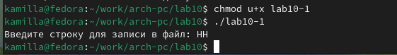
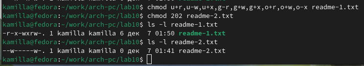
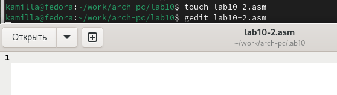
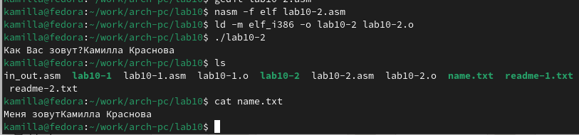

---
## Front matter
title: "Отчет по лабораторной работе №10"
subtitle: "Дисциплина: Архитектура компьютера"
author: "Краснова Камилла Геннадьевна"

## Generic otions
lang: ru-RU
toc-title: "Содержание"

## Bibliography
bibliography: bib/cite.bib
csl: pandoc/csl/gost-r-7-0-5-2008-numeric.csl

## Pdf output format
toc: true # Table of contents
toc-depth: 2
lof: true # List of figures
lot: true # List of tables
fontsize: 12pt
linestretch: 1.5
papersize: a4
documentclass: scrreprt
## I18n polyglossia
polyglossia-lang:
  name: russian
  options:
	- spelling=modern
	- babelshorthands=true
polyglossia-otherlangs:
  name: english
## I18n babel
babel-lang: russian
babel-otherlangs: english
## Fonts
mainfont: IBM Plex Serif
romanfont: IBM Plex Serif
sansfont: IBM Plex Sans
monofont: IBM Plex Mono
mathfont: STIX Two Math
mainfontoptions: Ligatures=Common,Ligatures=TeX,Scale=0.94
romanfontoptions: Ligatures=Common,Ligatures=TeX,Scale=0.94
sansfontoptions: Ligatures=Common,Ligatures=TeX,Scale=MatchLowercase,Scale=0.94
monofontoptions: Scale=MatchLowercase,Scale=0.94,FakeStretch=0.9
mathfontoptions:
## Biblatex
biblatex: true
biblio-style: "gost-numeric"
biblatexoptions:
  - parentracker=true
  - backend=biber
  - hyperref=auto
  - language=auto
  - autolang=other*
  - citestyle=gost-numeric
## Pandoc-crossref LaTeX customization
figureTitle: "Рис."
tableTitle: "Таблица"
listingTitle: "Листинг"
lofTitle: "Список иллюстраций"
lotTitle: "Список таблиц"
lolTitle: "Листинги"
## Misc options
indent: true
header-includes:
  - \usepackage{indentfirst}
  - \usepackage{float} # keep figures where there are in the text
  - \floatplacement{figure}{H} # keep figures where there are in the text
---


# Цель работы

Цель данной лабораторной работы - приобретение навыков написания программ для работы с файлами. 

# Задание

1. Создание файлов в программах
2. Изменение прав на файлы для разных групп пользователей
3. Выполнение самостоятельных заданий по материалам лабораторной работы.

# Теоретическое введение

ОС GNU/Linux является многопользовательской операционной системой. И для обеспечения защиты данных одного пользователя от действий других пользователей существуют специальные механизмы разграничения доступа к файлам. Кроме ограничения доступа, данный механизм позволяет разрешить другим пользователям доступ данным для совместной работы.
Права доступа определяют набор действий (чтение, запись, выполнение), разрешённых для выполнения пользователям системы над файлами. Для каждого файла пользователь может входить в одну из трех групп: владелец, член группы владельца, все остальные. Для каждой из этих групп может быть установлен свой набор прав доступа. Владельцем файла является его создатель.
Набор прав доступа задается тройками битов и состоит из прав на чтение, запись и исполнение файла. В символьном представлении он имеет вид строк rwx, где вместо любого символа может стоять дефис. Всего возможно 8 комбинаций, приведенных в таблице 10.1. Буква означает наличие права (установлен в единицу второй бит триады r — чтение, первый бит w — запись, нулевой бит х — исполнение), а дефис означает отсутствие права (нулевое значение соответствующего бита). Также права доступа могут быть представлены как восьмеричное число. Так, права доступа rw- (чтение и запись, без исполнения) понимаются как три двоичные цифры 110 или как восьмеричная цифра 6.


# Выполнение лабораторной работы

С помощью утилиты mkdir создаю директорию, в которой буду создавать файлы с программами для лабораторной работы №10 Перехожу в созданный каталог с помощью утилиты cd и с помощью утилиты touch создаю файлы lab10-1.asm,readme-1.txt и readme-2.txt(рис. [-@fig:001]).

{ #fig:001 width=70% }

Открываю созданный файл lab10-1.asm, вставляю в него программу (рис. [-@fig:002]).

{ #fig:002 width=70% }

Создаю исполняемый файл программы и запускаю его (рис. [-@fig:003]).

{ #fig:003 width=70% }

Меняю права владельца, запретив исполнять файл, после чего система отказывает в исполнении файла (рис. [-@fig:004]). Я - владелец, и сама запретила себе выполнять программу.

{ #fig:004 width=70% }

Добавляю к исходному файлу программы права владельцу на исполнение, (рис. [-@fig:005]). Программа исполняется, так как я владелец и разрешила выполнение программы.

{ #fig:005 width=70% }

Мой вариант - 17. Мне нужно установить следующие права на текстовые файлы, созданные в начале лабораторной работы:

1. В символьном виде для 1-го readme файла r-x -wx rw-
2. В двоичной системе для 2-го readme файла 010 000 010
Проверяю правильность выполнения.
 (рис. [-@fig:006]).

{ #fig:006 width=70% }


## Выполнение заданий для самостоятельной работы

1. Создаю файл lab10-2.asm с помощью утилиты touch и начинаю писать программу (рис. [-@fig:007]).

{ #fig:007 width=70% }


Создаю и запускаю новый исполняемый файл. Проверяю начиличе файла и его содержимое (рис. [-@fig:008]). 

{ #fig:008 width=70% }


**Код программы**

```NASM
%include 'in_out.asm'

SECTION .data
filename db 'name.txt', 0
prompt db 'Как Вас зовут?', 0
intro db 'Меня зовут', 0

SECTION .bss
name resb 255

SECTION .text
global _start
_start:
mov eax, prompt
call sprint

mov ecx, name
mov edx, 255
call sread

mov eax, 8
mov ebx, filename
mov ecx, 0744o
int 80h

mov esi, eax

mov eax, intro
call slen
mov edx, eax
mov ecx, intro
mov ebx, esi
mov eax, 4
int 80h

mov eax, name
call slen
mov edx, eax
mov ecx, name
mov ebx, esi
mov eax, 4
int 80h

mov ebx, esi
mov eax, 6
int 80h

call quit
```

# Выводы

При выполнении данной лабораторной работы я прибрела навыки написания программ для работы с файлами, научилась редактировать права для файлов.

# Список литературы

1. [Лабораторная работа 10](https://esystem.rudn.ru/pluginfile.php/2089097/mod_resource/content/0/%D0%9B%D0%B0%D0%B1%D0%BE%D1%80%D0%B0%D1%82%D0%BE%D1%80%D0%BD%D0%B0%D1%8F%20%D1%80%D0%B0%D0%B1%D0%BE%D1%82%D0%B0%20%E2%84%9610.%20%D0%A0%D0%B0%D0%B1%D0%BE%D1%82%D0%B0%20%D1%81%20%D1%84%D0%B0%D0%B9%D0%BB%D0%B0%D0%BC%D0%B8%20%D1%81%D1%80%D0%B5%D0%B4%D1%81%D1%82%D0%B2%D0%B0%D0%BC%D0%B8%20Nasm.pdf)
